# Workhand Tools

Workhand Tools is a Minecraft 26.2 (NeoForge) mod that adds upgraded pickaxes and shovels with area mining capabilities.

Each material tier (Stone, Iron, Diamond) offers 4 grades of tools — from basic 3x3 flat mining to professional 5x5x5 cubic excavation. All tools match the durability, mining speed, and enchantability of their vanilla counterparts.

## Features

- **12 pickaxes + 12 shovels** across 3 materials x 4 grades
- **Area mining** progression: 3x3x1 -> 3x3x3 -> 5x5x1 -> 5x5x5
- **Cubic / Flat mode toggle** on Advanced and Professional grades
- **Area preview highlight** showing exactly which blocks will be mined
- **10 language translations** including Spanish, French, German, Portuguese, Russian, Chinese, Japanese, Italian, and Korean
- **Descriptive tooltips** showing area dimensions and controls
- Full enchantment support (Efficiency, Fortune, Silk Touch, Unbreaking, Mending)
- Vanilla-standard durability, speed, and combat stats per material
- Custom crafting recipes with progression (Robust Stick component for Expert/Professional)
- **Workhand Hoes** (Iron/Diamond): right-click a mature crop, cocoa, or nether wart to harvest and instantly replant it, spreading to every other mature one in a 3x3 (Iron) or 5x5 (Diamond) area
- **Workhand Axes** (Iron/Diamond): right-click toggles tree felling with Simple/Compound modes
- **Improved Pickaxes** (Iron/Diamond): vein mining up to 128 connected ores
- **Kennestroyer Tools** (Pickaxe & Shovel): ultimate tools with 5 modes (Disabled, Range 3 Flat/Cubic, Range 5 Flat/Cubic) — Pickaxe includes vein mining
- **Tape Measure** utility item: right-click to set a measurement box, right-click again to finish it; live-updating wireframe with per-axis length labels while the box is in progress. Shift+right-click undoes the last box.

## Tools

<strong>Full item list — durability and purpose (36 items)</strong>

### Pickaxes & Shovels (24 — 3 materials × 4 grades)

| | Name | Material | Durability | Purpose |
|---|---|---|:---:|---|
| 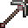 | Stone Workhand Pickaxe | Stone | 655 | Area mining 3x3x1 (single layer) |
| 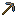 | Stone Workhand Advanced Pickaxe | Stone | 655 | Area mining 3x3x3 cubic / 3x3x1 flat (right-click toggles mode) |
| 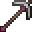 | Stone Workhand Expert Pickaxe | Stone | 655 | Area mining 5x5x1 (single layer) |
| 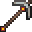 | Stone Workhand Professional Pickaxe | Stone | 655 | Area mining 5x5x5 cubic / 5x5x1 flat (right-click toggles mode) |
| 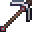 | Iron Workhand Pickaxe | Iron | 1250 | Area mining 3x3x1 (single layer) |
| 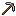 | Iron Workhand Advanced Pickaxe | Iron | 1250 | Area mining 3x3x3 cubic / 3x3x1 flat (right-click toggles mode) |
| 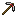 | Iron Workhand Expert Pickaxe | Iron | 1250 | Area mining 5x5x1 (single layer) |
| 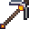 | Iron Workhand Professional Pickaxe | Iron | 1250 | Area mining 5x5x5 cubic / 5x5x1 flat (right-click toggles mode) |
| 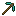 | Diamond Workhand Pickaxe | Diamond | 7805 | Area mining 3x3x1 (single layer) |
|  | Diamond Workhand Advanced Pickaxe | Diamond | 7805 | Area mining 3x3x3 cubic / 3x3x1 flat (right-click toggles mode) |
| 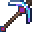 | Diamond Workhand Expert Pickaxe | Diamond | 7805 | Area mining 5x5x1 (single layer) |
| 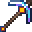 | Diamond Workhand Professional Pickaxe | Diamond | 7805 | Area mining 5x5x5 cubic / 5x5x1 flat (right-click toggles mode) |
| 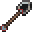 | Stone Workhand Shovel | Stone | 655 | Area digging 3x3x1 (single layer) |
| 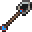 | Stone Workhand Advanced Shovel | Stone | 655 | Area digging 3x3x3 cubic / 3x3x1 flat (right-click toggles mode) |
| 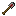 | Stone Workhand Expert Shovel | Stone | 655 | Area digging 5x5x1 (single layer) |
| 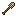 | Stone Workhand Professional Shovel | Stone | 655 | Area digging 5x5x5 cubic / 5x5x1 flat (right-click toggles mode) |
| 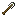 | Iron Workhand Shovel | Iron | 1250 | Area digging 3x3x1 (single layer) |
| 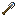 | Iron Workhand Advanced Shovel | Iron | 1250 | Area digging 3x3x3 cubic / 3x3x1 flat (right-click toggles mode) |
| 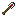 | Iron Workhand Expert Shovel | Iron | 1250 | Area digging 5x5x1 (single layer) |
| 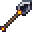 | Iron Workhand Professional Shovel | Iron | 1250 | Area digging 5x5x5 cubic / 5x5x1 flat (right-click toggles mode) |
| 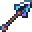 | Diamond Workhand Shovel | Diamond | 7805 | Area digging 3x3x1 (single layer) |
| 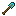 | Diamond Workhand Advanced Shovel | Diamond | 7805 | Area digging 3x3x3 cubic / 3x3x1 flat (right-click toggles mode) |
| 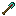 | Diamond Workhand Expert Shovel | Diamond | 7805 | Area digging 5x5x1 (single layer) |
| 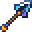 | Diamond Workhand Professional Shovel | Diamond | 7805 | Area digging 5x5x5 cubic / 5x5x1 flat (right-click toggles mode) |

### Kennestroyer Ultimate Tools (2)

| | Name | Material | Durability | Purpose |
|---|---|---|:---:|---|
| 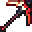 | Kennestroyer Pickaxe | Kennestroyer | 50,000 | **5 modes**: Disabled / 3x3x1 / 3x3x3 / 5x5x1 / 5x5x5 + Vein Mining (right-click cycles modes) |
| 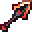 | Kennestroyer Shovel | Kennestroyer | 50,000 | **5 modes**: Disabled / 3x3x1 / 3x3x3 / 5x5x1 / 5x5x5 (right-click cycles modes) |

### Improved Pickaxes — vein mining (4)

| | Name | Material | Durability | Purpose |
|---|---|---|:---:|---|
| 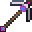 | Iron Workhand Advanced Improved Pickaxe | Improved Iron | 3750 | 3x3x3/3x3x1 area mining + vein mining: breaking an ore chain-breaks all connected blocks of the same ore (up to 128) |
| 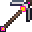 | Iron Workhand Professional Improved Pickaxe | Improved Iron | 3750 | 5x5x5/5x5x1 area mining + vein mining |
| 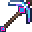 | Diamond Workhand Advanced Improved Pickaxe | Improved Diamond | 23415 | 3x3x3/3x3x1 area mining + vein mining |
| 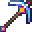 | Diamond Workhand Professional Improved Pickaxe | Improved Diamond | 23415 | 5x5x5/5x5x1 area mining + vein mining |

### Workhand Axes — tree felling (2)

| | Name | Material | Durability | Purpose |
|---|---|---|:---:|---|
| 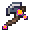 | Iron Workhand Axe | Improved Iron | 3750 | Toggleable tree felling (right-click): breaking a log fells the whole connected tree (up to 256 blocks) |
| 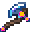 | Diamond Workhand Axe | Improved Diamond | 23415 | Toggleable tree felling (right-click) |

### Workhand Hoes — crop harvesting (2)

| | Name | Material | Durability | Purpose |
|---|---|---|:---:|---|
| 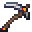 | Iron Workhand Hoe | Improved Iron | 3750 | Right-click a mature crop/cocoa/nether wart to harvest and instantly replant it, plus every other mature one in a 3x3 area |
| 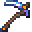 | Diamond Workhand Hoe | Improved Diamond | 23415 | Same as the Iron Workhand Hoe, but in a 5x5 area |

### Utility items (2)

| | Name | Material | Durability | Purpose |
|---|---|---|:---:|---|
|  | Robust Stick | — | No durability (ingredient) | Crafting ingredient for Expert and Professional grade tools (3-4) |
|  | Tape Measure | — | No durability (unbreakable) | Measures the area between two points: right-click sets the start, right-click again sets the end and draws a box with X/Y/Z lengths. Shift+right-click undoes the last measurement |

## Controls

| Action | Key |
|--------|-----|
| Area mine / dig | Left-click (no sneaking) |
| Single block | Shift + Left-click |
| Toggle mode (Grades 2 & 4) | Right-click |
| Cycle 5 modes (Kennestroyer) | Right-click |
| Set / finish measurement | Right-click block (Tape Measure) |
| Undo last measurement | Shift + Right-click (Tape Measure) |

## Requirements

| Component | Version |
|---|---|
| Minecraft | 26.2 |
| NeoForge | 26.2.0.37-beta+ |
| Vellumli | 1.2.0+ (required for guide book) |
| Java | 25+ |

## Installation

1. Install [NeoForge](https://neoforge.net/) for Minecraft 26.2.
2. Download the mod jar and place it in your `mods/` folder.

## License

**All Rights Reserved** — original mod by Stalking Dragons. Some parts come from other
projects and keep their own terms; see the [`LICENSE`](LICENSE) file:

- The **Tape Measure** tool and its texture are adapted from [Measurements](https://github.com/Mrbysco/Measurements)
  by Mrbysco (MIT).
- The **Chunk Anchor** model/texture and the **Anchor Tome** texture are adapted, with
  permission, from [Occultism](https://github.com/klikli-dev/occultism) by klikli-dev.

## Credits

- **Tape Measure** tool adapted from [Measurements](https://github.com/Mrbysco/Measurements) by Mrbysco (MIT License). The wireframe rendering and length-label placement were ported essentially as-is; the multi-loader plumbing was dropped to fit this single-loader NeoForge mod. The original `MeasurementBox` algorithm itself credits [MadeBaruna/BlockMeter](https://github.com/MadeBaruna/BlockMeter). The `tape_measure.png` item texture is reused from the same MIT-licensed source.
- **Chunk Anchor** block model/texture and **Anchor Tome** item texture reused, with permission, from [Occultism](https://github.com/klikli-dev/occultism) by klikli-dev — originally the `otherstone_pedestal` block and the `book_of_binding_djinni` item.

